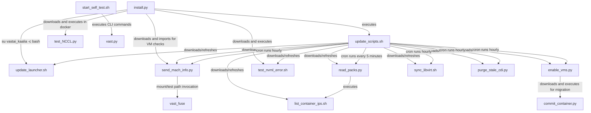

# Vast.ai Host Scripts

This directory contains the core scripts used for Vast.ai host setup and
management. These scripts are deployed by the Ansible role to configure GPU
hosts for the Vast.ai marketplace.

## Scripts Overview

### Core Installation & Setup

#### install.py

**Purpose**: Main installation script for setting up Vast.ai host software and
dependencies.

**Location**: `files/vast.ai/install.py`

**Source**: <https://s3.amazonaws.com/public.vast.ai/install>

**Functionality**:

- Installs NVIDIA drivers and CUDA toolkit
- Sets up the vastai_kaalia daemon user and data directory
- Configures Docker for GPU workloads
- Performs system compatibility checks
- Handles backup and restore operations

**Steps (CLI flow)**:

1. Probes host/environment and escalates privileges when needed:
    `lsb_release -cs`, `dpkg --print-architecture`, `id -u vastai_kaalia`, and
    re-executes via `sudo <python> install.py ...` when not root.
1. Optionally uploads logs (`--logs` path):
    `tar --ignore-failed-read -czf ...`, `curl --data-binary @... -X POST ...`,
    and fallback `apt-get -qq install curl` if `curl` is missing.
1. Creates/repairs daemon account and permissions:
    `groupadd docker`, `adduser --system ... vastai_kaalia`,
    `chown vastai_kaalia:docker -R /var/lib/vastai_kaalia`,
    optional `usermod -aG render|video vastai_kaalia`, and
    `su vastai_kaalia -c 'bash update_launcher.sh setup'`.
1. Optionally installs/reinstalls NVIDIA driver:
    `apt-get install dkms build-essential`, `update-initramfs -u`,
    `wget -c NVIDIA-Linux-...run`, `chmod +x`,
    `/bin/sh NVIDIA-Linux-...run -x --target ...`,
    `systemctl is-active lightdm`, `service lightdm stop`, `lsmod`,
    `rmmod nouveau`, and `nvidia-installer --disable-nouveau --ui=none --dkms`.
1. Handles TTY/display-manager edge paths during NVIDIA install:
    probes `xhost`; when applicable relaunches installer in VT with
    `openvt -s -- <python> ... --launched-in-vt`, and later restores GUI with
    `service lightdm start` if it was stopped.
1. Configures Docker storage (partition or loopback):
    `parted -sl`, `parted -s/-sm ... print free|mkpart`,
    `mount`, `umount`, `mkfs.xfs`, `blkid -s UUID -o value`,
    `rsync -XHAa`, and `rm -rf /var/lib/docker-temporarily-renamed/`.
1. Installs Docker and NVIDIA runtime packages:
    `apt-get remove docker docker-engine docker.io`,
    `apt-get update`, `apt-get install apt-transport-https ca-certificates curl software-properties-common rsync`,
    `curl ... | apt-key add -`, `apt-key fingerprint 0EBFCD88`,
    `add-apt-repository ... download.docker.com ... stable`,
    `curl ... nvidia-docker/.../gpgkey | apt-key add -`,
    `apt-get install nvidia-docker2`, `systemctl enable docker`,
    `service docker start`, `pkill -SIGHUP dockerd`.
1. Optionally installs libvirt stack:
    downloads `send_mach_info.py` via `wget`, then runs
    `apt install qemu-kvm libvirt-daemon-system cloud-utils` and
    `usermod -a -G kvm,libvirt,libvirt-qemu vastai_kaalia`, or fallback
    `apt-get install libvirt-dev` when full VM support checks fail.
1. Runs post-install validation and daemon startup:
    `docker pull ubuntu`, `wget ... test_nvml_error.sh && chmod +x ...`,
    executes `test_nvml_error.sh`, runs NCCL test via a `docker run ... pytorch/pytorch ...` command,
    starts daemon using `su vastai_kaalia -c 'bash update_launcher.sh run'`,
    then pulls default image `docker pull pytorch/pytorch`.
1. Refreshes host helper scripts:
    `sudo -u vastai_kaalia bash -c 'wget ... update_scripts.sh; chmod +x ...; ./update_scripts.sh'`.

**Usage**:

```bash
sudo python3 install.py
```

#### update_scripts.sh

**Purpose**: Updates Vast.ai scripts and configures scheduled tasks.

**Location**: `files/vast.ai/update_scripts.sh`

**Source**: <https://s3.amazonaws.com/public.vast.ai/kaalia/scripts/update_scripts.sh>

**Functionality**:

- Downloads latest versions of Vast.ai scripts from S3
- Updates cron jobs for periodic tasks
- Installs additional system dependencies (tshark)
- Configures automated script updates

**Steps (CLI flow)**:

1. Downloads script payloads into `/var/lib/vastai_kaalia/` with a temporary file pattern:
    `wget <url> -O <script>.tmp && chmod +x <script>.tmp && mv -f <script>.tmp <script>`.
1. Applies compatibility rewrite for older launchers:
    `cat update_launcher.sh | sed -e 's#/vast.ai/static$#/public.vast.ai/kaalia/daemons$#' > ...tmp && mv -f ...tmp update_launcher.sh`.
1. Refreshes CLI helper:
    `wget https://raw.githubusercontent.com/vast-ai/vast-cli/master/vast.py -O vast; chmod +x vast`.
1. Rebuilds crontab entries:
    `crontab -l > mycron23`, a sequence of `sed -i '/.../d' mycron23`, append new jobs with `echo ... >> mycron23`, then
    `crontab mycron23` and `rm mycron23`.
1. Installs/sets host runtime config:
    `sudo DEBIAN_FRONTEND=noninteractive apt-get install -yq tshark`,
    `sudo sysctl -w kernel.core_pattern=...`, and two `sudo sed -i` edits on `/etc/security/limits.conf`.

**Usage**:

```bash
sudo ./update_scripts.sh
```

### Monitoring & Reporting

#### send_mach_info.py

**Purpose**: Collects detailed machine information and sends it to Vast.ai servers.

**Location**: `files/vast.ai/send_mach_info.py`

**Source**: <https://s3.amazonaws.com/vast.ai/send_mach_info.py>

**Functionality**:

- Gathers hardware specifications (CPU, GPU, RAM, storage)
- Collects PCI device information and IOMMU groups
- Reports system capabilities and available resources
- Sends periodic updates to Vast.ai marketplace

**Steps (CLI flow)**:

1. Performs baseline host probes and opportunistic package readiness checks:
    random `sudo apt update`, `lsb_release -a`, `df --output=avail -BG /var/lib/docker`,
    `grep ... kaalia.log`, `journalctl ... | grep ... | tail -n 1`, and `nvidia-smi`.
1. Ensures required binaries exist when missing:
    `which <package>` and `sudo apt install -y <package>` (for example `fio`).
1. Runs optional bandwidth/speed diagnostics:
    `docker run --rm vastai/test:speedtest ... -L`,
    `docker run --rm vastai/test:speedtest ... -s <id>`,
    synthetic disk tests with `sudo fio ...`, occasional `docker builder prune --force`.
1. Collects Docker/container and storage telemetry:
    `docker ps -q`, `docker inspect <container>`, `lsblk -sJap`, `du -s <mount>`.
1. For network-disk checks, mounts and tests Vast FUSE paths:
    `/var/lib/vastai_kaalia/vast_fuse ...`, `sudo mountpoint -q`,
    `sudo fusermount -u <path>`, and `sudo fio --output-format=json -`.
1. Verifies VM prerequisites and runtime state:
    `sudo cat /sys/.../class`, `sudo cat /sys/module/nvidia_drm/parameters/modeset`,
    and `systemctl is-active gdm`.
1. Sends results via HTTPS API calls (`requests.put`) to Vast endpoints.

**Usage**:

```bash
python3 send_mach_info.py
```

#### read_packs.py

**Purpose**: Monitors network traffic and reads container IP assignments.

**Location**: `files/vast.ai/read_packs.py`

**Source**: <https://s3.amazonaws.com/public.vast.ai/kaalia/scripts/read_packs.py>

**Functionality**:

- Uses tshark to capture network packets on docker0 interface
- Correlates captured traffic with Docker container IPs
- Monitors network activity for billing and security purposes
- Runs periodically via cron job

**Steps (CLI flow)**:

1. Captures packets from Docker bridge:
    `sudo tshark -p -i docker0 -c 4096 -a duration:0.05 -w /tmp/output.pcap`.
1. Loads live container IP/name mapping:
    `/var/lib/vastai_kaalia/list_container_ips.sh`.
1. Parses capture into src/dst/length rows:
    `sudo tshark -r /tmp/output.pcap -T fields -e ip.src -e ip.dst -e frame.len`.
1. Aggregates local/global in/out byte counters and persists to `cont_pack_data.json`.

**Usage**:

```bash
python3 read_packs.py
```

#### report_copy_success.py

**Purpose**: Reports successful data copy operations to Vast.ai.

**Location**: `files/vast.ai/report_copy_success.py`

**Source**: <https://s3.amazonaws.com/public.vast.ai/kaalia/scripts/report_copy_success.py>

**Functionality**:

- Monitors file copy operations
- Reports completion status to Vast.ai servers
- Tracks data transfer success/failure metrics

**Steps (CLI flow)**:

1. Reads machine key from `/var/lib/vastai_kaalia/machine_id`.
1. Constructs copy-success payload for the target container/task.
1. Sends `PUT https://console.vast.ai/api/daemon/task/` via Python `requests`.
1. On failure, appends error details to
    `/var/lib/vastai_kaalia/data/instance_extra_logs/C.<container_name>`.

System commands executed by this script: none (no `subprocess`/shell calls).

**Usage**:

```bash
python3 report_copy_success.py
```

### Virtual Machine Management

#### enable_vms.py

**Purpose**: Manages virtual machine enablement and PCI passthrough configuration.

**Location**: `files/vast.ai/enable_vms.py`

**Source**: <https://s3.amazonaws.com/public.vast.ai/kaalia/scripts/enable_vms.py>

**Functionality**:

- Configures IOMMU groups for PCI passthrough
- Enables/disables VM functionality on the host
- Manages GPU and device assignment to virtual machines
- Handles libvirt integration for VM management

**Steps (CLI flow)**:

1. Validates IOMMU grouping and modeset status using:
    `sudo cat /sys/.../class` and `sudo cat /sys/module/nvidia_drm/parameters/modeset`.
1. Supports multiple command modes:
    `on` (full VM enablement test flow), `off` (removes VM config marker),
    `check` (prints pending/on/off based on marker/config), and `validate`
    (IOMMU/modeset prerequisite check).
1. On `on`, installs virtualization/runtime dependencies:
    `apt -y install libvirt-daemon-system qemu-kvm psmisc`,
    `docker pull docker.io/vastai/kvm:cuda-12.9.1-auto`,
    `usermod -aG libvirt vastai_kaalia`, `systemctl restart libvirtd`.
1. Drains state and prepares daemon service for test:
    `docker container ls -q`, `systemctl stop vastai`, move service unit,
    `systemctl daemon-reload`, and `systemctl is-active gdm` checks.
1. Verifies NVIDIA/host state:
    `nvidia-smi -q -d PIDS`, `nvidia-smi -L`,
    `/var/lib/vastai_kaalia/latest/kaalia_nv_use_check <gpu_count>`.
1. Launches VM validation container and checks GPU passthrough:
    `docker run ... --device /dev/kvm --name=vm_test docker.io/vastai/kvm:cuda-12.9.1-auto ...`,
    `virsh qemu-agent-command vm_test ... guest-exec`,
    `virsh qemu-agent-command vm_test ... guest-exec-status`,
    `docker stop vm_test`.
1. On failure, performs cleanup/recovery:
    `rmmod nvidia-drm`, `rmmod nvidia-modeset`, `rmmod nvidia-uvm`,
    `rmmod nvidia`, `nvidia-smi`.
1. Restores service state in all cases:
    move service unit back, `systemctl daemon-reload`, `systemctl start vastai`.
1. Includes migration helper path (when `-f`) for old containers:
    `docker info --format=json`, `docker ps -a --format=json`,
    `docker inspect <id>`, optional `timeout 10 nvidia-smi -x -q`,
    optional `wget -O /var/lib/vastai_kaalia/task_handlers/commit_container.py ...` and `chmod +x ...`.
1. Runs conversion helper script for legacy container GPU env values when needed:
    `/var/lib/vastai_kaalia/task_handlers/commit_container.py <task_info_json> <task_context_json>`.

**Usage**:

```bash
sudo python3 enable_vms.py on    # Enable VMs
sudo python3 enable_vms.py off   # Disable VMs
```

#### commit_container.py

**Purpose**: Rebuilds or commits Vast containers and optionally pushes snapshots
to a registry.

**Location**: `files/vast.ai/commit_container.py`

**Source**: <https://s3.amazonaws.com/public.vast.ai/commit_container.py>

**Functionality**:

- Rebuilds a container filesystem by tarring/restoring write-layer contents
- Supports direct Docker commit workflows
- Can authenticate to a registry and push timestamped snapshots
- Preserves/overrides environment and mount settings during recreation

**Steps (CLI flow)**:

1. Entry point expects two JSON arguments:
    `python3 commit_container.py '<task_info_json>' '<task_context_json>'`.
1. Dispatches by `task_info["op"]`:
    `version`, `commit`, `rebuild`, or `take_snapshot_and_push`.
1. Shared inspection/helpers use:
    `docker container inspect <container>` and
    `sudo du -sb <upperdir>` to size-check writable layer.
1. `rebuild` mode executes container replacement by write-layer tar transfer:
    `docker rename <name> <name>_old`,
    `sudo tar --directory=<old_base> -cf <name>.tar diff`,
    `docker create --name <name> --runtime=nvidia ...`,
    `sudo tar --directory=<new_base> -xf <name>.tar`,
    `sudo rm <name>.tar`, and `docker rm <name>_old`.
1. `rebuild` rollback path uses:
    `docker rm <name>` then `docker rename <name>_old <name>`.
1. `commit` mode commits and optionally recreates:
    `docker commit <container> <image>`, optional
    `docker rename <name> <name>_old`, `docker create ...`, and
    `docker rm <name>_old`.
1. `take_snapshot_and_push` mode performs registry snapshot workflow:
    `docker --config=<tmp_cfg> logout`,
    `docker --config=<tmp_cfg> login -u <user> --password-stdin <registry>`,
    `docker container commit --pause=<true|false> C.<instance_id> <snapshot_tag>`,
    `docker --config=<tmp_cfg> push <snapshot_tag>`,
    cleanup `docker image rm <snapshot_tag>` and remove temporary config dir.

**Usage**:

```bash
# Rebuild a container in place
python3 commit_container.py '{"op":"rebuild"}' '{"container_name":"C.12345"}'

# Return script version
python3 commit_container.py '{"op":"version"}' '{}'
```

#### sync_libvirt.sh

**Purpose**: Synchronizes libvirt configuration for virtual machine management.

**Location**: `files/vast.ai/sync_libvirt.sh`

**Source**: <https://s3.amazonaws.com/public.vast.ai/kaalia/scripts/sync_libvirt.sh>

**Functionality**:

- Updates libvirt daemon configuration
- Ensures proper VM networking setup
- Synchronizes virtual machine definitions

**Steps (CLI flow)**:

1. Creates two temp lists:
    `mktemp` (twice), `sudo virsh list --name | sort > <tmp1>`, and
    `sudo docker ps --format "{{.Names}}" | sort > <tmp2>`.
1. Computes VMs present in libvirt but missing from Docker:
    `comm -23 <tmp1> <tmp2>`.
1. For each guest matching `^C\.[0-9]+`, runs:
    `virsh destroy <guest>` and `virsh undefine <guest> --nvram`.
1. Removes temporary files.

**Usage**:

```bash
sudo ./sync_libvirt.sh
```

### Container Management

#### list_container_ips.sh

**Purpose**: Lists IP addresses of running Docker containers.

**Location**: `files/vast.ai/list_container_ips.sh`

**Source**: <https://s3.amazonaws.com/public.vast.ai/kaalia/scripts/list_container_ips.sh>

**Functionality**:

- Queries Docker for running containers
- Extracts IP addresses from container network settings
- Outputs JSON-formatted IP mapping for monitoring

**Steps (CLI flow)**:

1. Enumerates running containers with `docker ps -q`.
1. For each container ID, reads:
    `docker inspect -f '{{range .NetworkSettings.Networks}}{{.IPAddress}}{{end}}' <id>` and
    `docker inspect -f '{{.Name}}' <id>`.
1. Emits a JSON object mapping container name to IP.

**Usage**:

```bash
./list_container_ips.sh
```

#### purge_stale_cdi.py

**Purpose**: Removes stale Container Device Interface (CDI) configuration files.

**Location**: `files/vast.ai/purge_stale_cdi.py`

**Source**: <https://s3.amazonaws.com/public.vast.ai/kaalia/scripts/purge_stale_cdi.py>

**Functionality**:

- Scans /etc/cdi/ for CDI configuration files
- Identifies configs for non-existent containers
- Removes stale CDI YAML files to prevent conflicts
- Maintains clean CDI configuration state

**Steps (CLI flow)**:

1. Scans CDI directory (default `/etc/cdi`) for files matching
    `D.<container-id>.yaml`.
1. For each match, validates container existence with:
    `docker container inspect <container_id>`.
1. If container is missing:
    in normal mode it deletes the YAML; in `--dry-run` it reports only.
1. Prints summary of removed/would-remove files.

**Usage**:

```bash
sudo python3 purge_stale_cdi.py
```

### Testing & Diagnostics

#### test_nvml_error.sh

**Purpose**: Tests for NVIDIA Management Library (NVML) initialization errors.

**Location**: `files/vast.ai/test_nvml_error.sh`

**Source**: <https://s3.amazonaws.com/vast.ai/test_nvml_error.sh>

**Functionality**:

- Launches a Docker container with NVIDIA GPU access
- Tests NVML initialization in containerized environment
- Detects "Unknown Error" issues that can affect GPU availability
- Validates GPU device access after systemd daemon reloads

**Steps (CLI flow)**:

1. Detects GPU count: `nvidia-smi -L | wc -l`.
1. Starts long-running GPU container:
        ```bash
        docker run -d --rm --runtime=nvidia -e NVIDIA_VISIBLE_DEVICES=all \
            nvcr.io/nvidia/cuda:12.0.0-base-ubuntu20.04 \
            bash -c 'while true; do nvidia-smi -L; sleep 5; done'
        ```
1. Triggers daemon reload: `sudo systemctl daemon-reload`.
1. Reads container logs: `docker logs <container_id>`.
1. Detects NVML issue with:
    `docker logs <container_id> | grep -c 'Failed to initialize NVML: Unknown Error'`.
1. Stops test container: `docker stop <container_id>`.

**Usage**:

```bash
sudo ./test_nvml_error.sh
```

#### test_NCCL.py

**Purpose**: Tests NVIDIA Collective Communications Library (NCCL) functionality.

**Location**: `files/vast.ai/test_NCCL.py`

**Source**: <https://s3.amazonaws.com/vast.ai/test_NCCL.py>

**Functionality**:

- Tests multi-GPU communication using NCCL
- Validates PyTorch distributed training capabilities
- Performs GPU-to-GPU data transfer tests
- Checks for NCCL-related performance issues

**Steps (CLI flow)**:

1. Parses CLI flags (`--backend`, `--num-gpus`, `--num-machines`, `--machine-rank`, `--dist-url`).
1. Sets process environment (`OMP_NUM_THREADS=1`, `NCCL_DEBUG=INFO`) and spawns one process per GPU.
1. Each worker initializes distributed backend via `torch.distributed.init_process_group`.
1. Workers synchronize with `dist.barrier()`, select CUDA device, build local process groups, and run a tensor op.

System commands executed by this script: none (uses Python/PyTorch APIs only).

**Usage**:

```bash
python3 test_NCCL.py --num_gpus 2 --backend nccl
```

#### start_self_test.sh

**Purpose**: Initiates self-test procedures for the Vast.ai host.

**Location**: `files/vast.ai/start_self_test.sh`

**Source**: <https://s3.amazonaws.com/public.vast.ai/kaalia/scripts/start_self_test.sh>

**Functionality**:

- Runs comprehensive system diagnostics
- Tests GPU functionality and availability
- Validates network connectivity
- Performs automated health checks

**Steps (CLI flow)**:

1. Redirects all output to `/var/lib/vastai_kaalia/self_test.log`.
1. Sleeps for daemon stabilization (`sleep 10m`).
1. Checks listing status using:
        ```bash
        python3 /var/lib/vastai_kaalia/vast show machine <id> --raw --url <server> \
            --api-key <session_key> | grep -q '"listed": true'
        ```
1. If not listed, temporarily lists machine:
        ```bash
        python3 /var/lib/vastai_kaalia/vast list machine <id> -g <gpu_pph> -m <min_count> \
            -r <reserved_discount> -e <epoch> --url <server> --api-key <session_key>
        ```
1. Runs self-test command:
    `python3 /var/lib/vastai_kaalia/vast self-test machine <id> --ignore-requirements --url <server> --api-key <session_key>`.
1. On success, reports result with:
        ```bash
        curl -X POST <server>/api/v0/daemon/report_self_test_results/ \
            -H 'Authorization: Bearer ...' \
            -H 'Content-Type: application/json' \
            -d '{...}'
        ```
1. Always unlists machine at end:
    `python3 /var/lib/vastai_kaalia/vast unlist machine <id> --url <server> --api-key <session_key>`.

**Usage**:

```bash
sudo ./start_self_test.sh
```

### Utilities

#### vast.py

**Purpose**: Vast.ai command-line interface tool.

**Location**: `files/vast.ai/vast.py`

**Source**: <https://raw.githubusercontent.com/vast-ai/vast-cli/master/vast.py>

**Functionality**:

- Command-line interface for Vast.ai marketplace
- Instance management and monitoring
- API interaction capabilities

**Steps (CLI flow)**:

1. Resolves local version and optional update workflow:
    `git describe --tags --abbrev=0` (git install mode) or pip metadata lookup.
1. If user accepts upgrade prompt, executes update command via subprocess:
    either `python -m pip install --force-reinstall --no-cache-dir vastai==<version>` or
    `git fetch --all --tags --prune && git checkout tags/v<version>`.
1. For long output, opens pager when available:
    `less -R`.
1. In local/remote copy flows, executes generated host commands:
    `mkdir -p <path>` and
    `rsync -arz -v --progress --rsh=ssh -e 'ssh ... -p <port> -o StrictHostKeyChecking=no' ...`.
1. For SSH key generation helpers, runs:
    `ssh-keygen -t ed25519 -f <path> -N '' -C '<user>-vast.ai'`.

Note: `vast.py` is a large multi-command CLI; exact subprocess usage depends on the selected subcommand path.

**Usage**:

```bash
python3 vast.py --help
```

#### vast_fuse

**Purpose**: FUSE-based filesystem utilities for Vast.ai.

**Location**: `files/vast.ai/vast_fuse`

**Source**: <https://s3.amazonaws.com/public.vast.ai/kaalia/scripts/vast_fuse>

**Functionality**:

- Provides filesystem mounting capabilities
- Handles data transfer operations
- Manages storage integration

**Steps (CLI flow)**:

1. `vast_fuse` is a compiled executable in this repository snapshot (not a shell/Python source file).
1. CLI entrypoint pattern from caller scripts (for example `send_mach_info.py`):
    `sudo /var/lib/vastai_kaalia/vast_fuse -m <disk_mountpoint> -q <size_gb> -- -o allow_other <fs_mountpoint>`.
1. Mount lifecycle is typically paired with:
    `sudo mountpoint -q <fs_mountpoint>` and `sudo fusermount -u <fs_mountpoint>`.

**Usage**:

```bash
./vast_fuse [options]
```

#### update_launcher.sh

**Purpose**: Updates the launcher component of Vast.ai host software.

**Location**: `files/vast.ai/update_launcher.sh`

**Source**: <https://s3.amazonaws.com/public.vast.ai/kaalia/scripts/update_launcher.sh>

**Functionality**:

- Downloads updated launcher binaries
- Updates launcher configuration
- Manages launcher service restarts

**Steps (CLI flow)**:

1. Changes to daemon home: `cd ~vastai_kaalia`.
1. Downloads update installer:
    `wget -q https://s3.amazonaws.com/public.vast.ai/kaalia/daemons$(cat ~/.channel 2>/dev/null)/update -O install_update.sh`.
1. Marks installer executable: `chmod +x install_update.sh`.
1. Executes installer with passthrough args: `./install_update.sh "$@"`.

**Usage**:

```bash
sudo ./update_launcher.sh
```

## Script Dependency Graph



## Deployment

These scripts are automatically deployed by the Ansible role to
`/var/lib/vastai_kaalia/` on target hosts. The role ensures proper permissions
and execution capabilities are set.

For manual host setup instructions, see: <https://cloud.vast.ai/host/setup/>

## Re-sync all scripts

To re-download and replace all files listed in this document, run:

```bash
./scripts/sync_all_scripts.sh
```

Use dry-run mode to preview without changing files:

```bash
./scripts/sync_all_scripts.sh --dry-run
```

## Source URLs

- Primary scripts example: <https://s3.amazonaws.com/vast.ai/send_mach_info.py>
- Public scripts example: <https://s3.amazonaws.com/public.vast.ai/install>
- Kaalia scripts example: <https://s3.amazonaws.com/public.vast.ai/kaalia/scripts/update_scripts.sh>
- CLI Tool: <https://raw.githubusercontent.com/vast-ai/vast-cli/master/vast.py>
